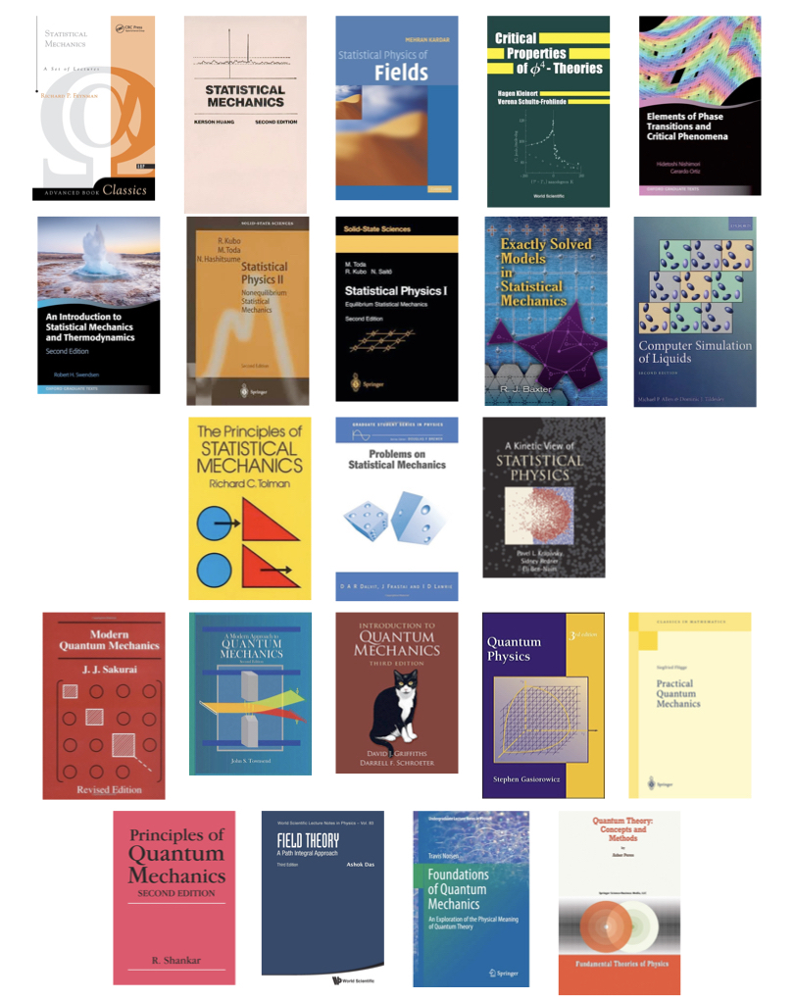

# Books on quantum mechanics and statistical mechanics

2023-07-31, Monday

In the last two weekends, I shared my favorite books on [statistical mechanics](https://twitter.com/arghya_dutta_/status/1683072915468607488) and [quantum mechanics](https://twitter.com/arghya_dutta_/status/1685237733898285056) on Twitter. Quite a few people found the lists useful. Also, some replied with their favorites. Some were new to me and they look promising! Please check the comments in the threads for those books. Happy reading! 🙂

## Statistical mechanics

1. **Feynman's "Statistical Mechanics"** is a good book—but the beginning is spectacular. He puts the partition function in the place it deserves.
2. **Kerson Huang's "Statistical Mechanics"** is broad and concise. I especially loved the chapter on the general properties of the partition function for its discussion on the zeroes of the partition function and phase transition.
3. On the field-theoretic formulation of critical phenomena, the best book, in my opinion, is **Mehran Kardar's "Statistical Physics of Fields."** The chapters on the perturbative renormalization group of $\phi^4$ theories are superb.
4. I should mention that if you're actually trying to calculate higher-order Feynman diagrams, **Kleinert and Schulte-Frohlinde's "Critical Properties of $\phi^4$-Theories"** is *the reference* you need.
5. Also, in this connection, I found a neat discussion on mean field theories (particularly $\phi^6$ theory related to tricritical points) in **Nishimori and Ortiz's "Elements of Phase Transitions and Critical Phenomena."**
6. I bought **R. Swendsen's "An Introduction to Statistical Mechanics and Thermodynamics"** fairly recently. It's a great book and, unusually, starts with detailed discussions on entropy. (The book has slightly unwieldy, verbose notations, but I think explicit notations help.)
7. **Ryogo Kubo's statistical mechanics books** are some of the most didactic books I've ever read. Very much recommended.
8. I read Onsager's solution of the 2D Ising model during masters (along with its complete solution 😱). It's not easy, but if you *really need* to know about exactly solvable models, I think the best resource is **Rodney Baxter's "Exactly Solved Models in Statistical Mechanics.**"
9. For numerical approaches in stat mech, I liked **D. J. Tildesley and M.P. Allen's "Computer Simulation of Liquids"** most for its clean, accessible discussions (for instance, check the discussion on ensembles in MD simulations.)
10. A book that I read only a bit—but was thoroughly impressed by its depth—is **Richard Tolman's "The Principles of Statistical Mechanics."** Have to read it sometime in the future…
11. **Dalvit, Frastai, and Lawrie's "Problems on Statistical Mechanics"** is excellent (more so because it comes with solutions. 😄) Check it if you want to know, for example, under which conditions bosons with a $p^s$ dispersion relation in $d$-dimensions will form a condensate…🙂
12. Finally, on nonequilibrium stat mech, I liked reading **Pavel Krapivsky, Sidney Redner, and Eli Ben-Naim's "Kinetic View of Statistical Physics."** The chapters on aggregation, fragmentation, and adsorption are particularly good.

## Quantum mechanics

1. For me, the best graduate-level QM book is **Sakurai's "Modern Quantum Mechanics."** Precise and concise. (And the exercises are *very* carefully designed.)
2. I like to think **John Townsend's excellent "A Modern Approach to Quantum Mechanics"** as an easier version of Sakurai's book. However, it is costly. Not sure why…
3. **Griffiths's "Introduction to Quantum Mechanics"** is a good undergrad-level QM textbook. The chapter on solutions to time-independent Schrödinger equation is neat. (Though, for learning formalism, I prefer Sakurai's book.)
4. Another undergrad-level QM book I liked is **Stephen Gasiorowicz's "Quantum Physics."** It's at the level of Griffiths's and comes with many detailed examples. Though not as popular, it provides a solid introduction.
5. **"Practical quantum mechanics" by Siegfried Flügge** teaches QM through problem-solving. It's not easy, but by solving its problems, you can learn a lot and gain confidence.
6. I love **R. Shankar's graduate-level "Principles of Quantum Mechanics."** The chapters on rotational invariance, addition of angular momenta, scattering theory, and path integral are particularly good.
7. I would like to mention that for the path integral formalism of QM, the first few chapters of **Ashok Das's "Field Theory: A Path Integral Approach"** provide a pedagogic introduction.
8. Only recently, I started reading about the foundations of QM. It's a great subject—until you want to publish. 😀 So far, I liked two books. The first one is **"Foundations of Quantum Mechanics" by Travis Norsen**. Very accessible (though I found it slightly opinionated)
9. The second one is **"Quantum Theory: Concepts and Methods" by Asher Peres**. I've bought it recently and read only a bit. It goes deep into QM and is easily the most difficult of all the books I mentioned. Very rewarding, though.
